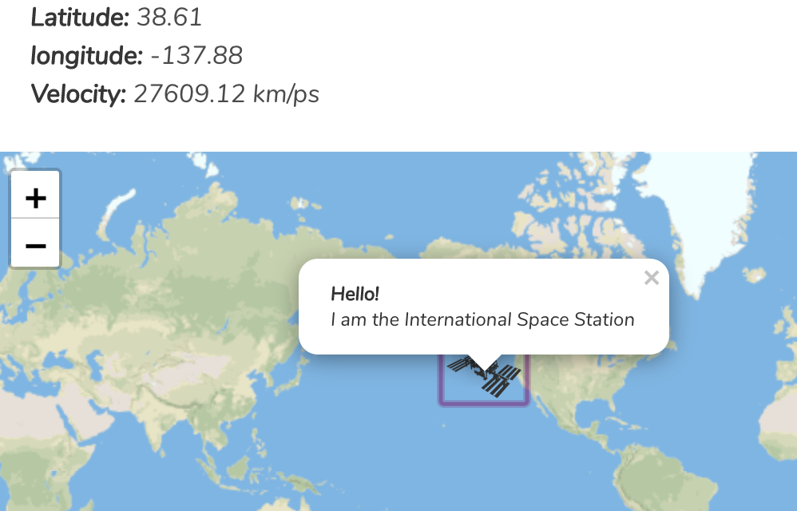

# Where is the Internation Space Station

> A web application built that allows the user to observe where the current location of the ISS

[Click to play](https://objective-darwin-0b23b4.netlify.com) 

## Technologies

Leaflet.js used to display the map on the page  
Thanks to [open map tiles](https://openmaptiles.org/docs/website/leaflet/) for the vector tiles used

## How it Works

TODO
